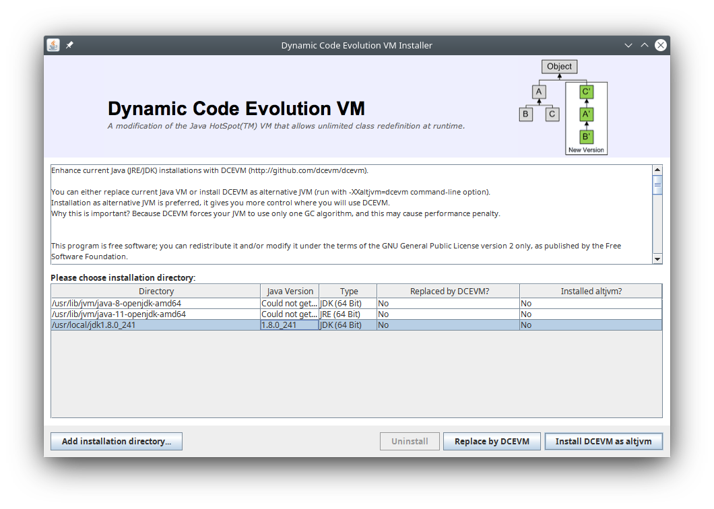

## HotswapAgent

<https://github.com/HotswapProjects/HotswapAgent>

```
# java -jar DCEVM-8u181-installer-build2.jar 
```

Click **Add installation directory** if necessary jvm directory is absent.
Press **Install DCEVM as altjvm**



Set MAVEN_OPTS like in [setdebug.sh](setdebug.sh)

```
$ . ~/bin/setdebug.sh
$ echo $MAVEN_OPTS
-agentlib:jdwp=transport=dt_socket,server=y,suspend=n,address=8787 -XXaltjvm=dcevm -javaagent:/home/user/bin/java/hotswap-agent-1.3.1-SNAPSHOT.jar
$ mvn -B jetty:run > ../../hswp-log.txt 2>&1
```

Doesn't run jetty:run from Netbeans.

Optionally modify [hotswap-agent.properties](hotswap-agent.properties) and put it to classpath.

It's possible to watch classes of several projects. Define extraClasspath

```
extraClasspath=./target/classes; \
./../other-project/target/classes; \
./../other-project-1/target/classes
```

Maven settings for hotswap-agent.properties

```xml
    <plugin>
        <groupId>org.eclipse.jetty</groupId>
        <artifactId>jetty-maven-plugin</artifactId>
        <version>${jetty.version}</version>
        <configuration>
            <httpConnector>
                <port>8090</port>
            </httpConnector>
            <webApp>
                <contextPath>/${project.artifactId}</contextPath>

  <!-- add path to hotswap-agent.properties -->
                <extraClasspath>${basedir}/../src/main/hsw</extraClasspath>

            </webApp>
            <systemProperties>
                <systemProperty>
                    <name>org.apache.jasper.compiler.disablejsr199</name>
                    <value>true</value>
                </systemProperty>
                <systemProperty>
                    <name>JETTY_HOME</name>
                    <value>${project.build.directory}/jetty</value>
                </systemProperty>
                <systemProperty>
                    <name>jetty.home</name>
                    <value>${project.build.directory}/jetty</value>
                </systemProperty>
                <systemProperty>
                    <name>init.properties.path</name>
                    <value>classpath:/init-dev.properties</value>
                </systemProperty>
            </systemProperties>
        </configuration>
    </plugin>
```

Configuration to work with persistence

Define property my.persistenceXmlLocation as 

```
my.persistenceXmlLocation=file:${project.build.directory}/../../other-project/target/classes/META-INF/persistence.xml
```

and use it to set persistenceXmlLocation

```xml
    <bean id="entityManagerFactory" primary="true" class="org.springframework.orm.jpa.LocalContainerEntityManagerFactoryBean">
        <property name="dataSource" ref="dataSource" />
        <property name="persistenceUnitName" value="mpbx" />
        <property name="packagesToScan" value="ru.sifox.mpbx.entity" />
        <property name="jpaPropertyMap">
            <map>
                <entry key="eclipselink.weaving" value="static" />
                <entry key="eclipselink.logging.level" value="${jdbc.eclipselink.logging.level}"/>
                <entry key="eclipselink.logging.parameters" value="true"/>
                <entry key="eclipselink.logging.jpa.query" value="${jdbc.eclipselink.logging.jpa.query}"/>
                <entry key="eclipselink.logging.jpa.query.object" value="${jdbc.eclipselink.logging.jpa.query.object}"/>
            </map>
        </property>
        <property name="jpaVendorAdapter">
            <bean class="org.springframework.orm.jpa.vendor.EclipseLinkJpaVendorAdapter">
                <property name="databasePlatform" value="org.eclipse.persistence.platform.database.OraclePlatform" />
            </bean>
        </property>
        <property name="jpaDialect">
            <bean class="org.springframework.orm.jpa.vendor.EclipseLinkJpaDialect">
                <property name="lazyDatabaseTransaction" value="true" />
            </bean>
        </property>
        <property name="persistenceXmlLocation" value="${my.persistenceXmlLocation}" />
    </bean>

```

## Vaadin

<https://vaadin.com/docs/v14/guide/live-reload/hotswap-agent>

Don't use [@PreserveOnRefresh](https://vaadin.com/docs/v14/flow/advanced/tutorial-preserving-state-on-refresh) and open route in new window or tab.

